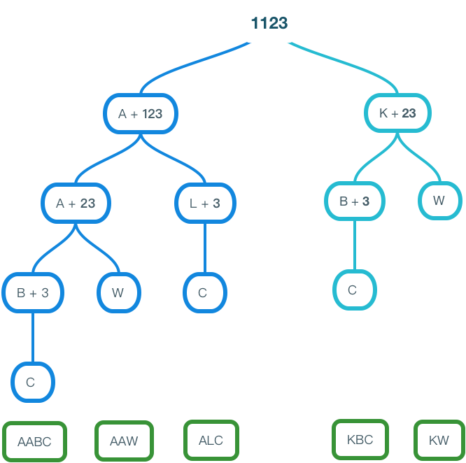

# Decode Ways
A message containing letters from A-Z can be encoded into numbers using the following mapping:
* '1' -> 'A'
* '2' -> 'B'
* '3' -> 'C'
...
* '26' -> 'Z'

To decode an encoded message, all the digits must be grouped then mapped back into letters using the reverse of the mapping above (there may be multiple ways). For example, "11023" can be mapped into:
* 1, 10, 2, 3 -> AJBC 
* 1, 20, 23 -> AJW

Note that the grouping (11 02 3) is invalid because "06" cannot be mapped into 'B' since "2" is different from "02".
Given a string s containing only digits, return the number of ways to decode it.
The answer is guaranteed to fit in a 32-bit integer.

# Additional Information
1. Memo
Use an object to store the calcuated result so we don't need to **re-calculate** everytime we run into same result. In this case, if we convert 3 into C, and 23 into BC, W, once we run into 23, we don't even need to convert. We can just pull out froom our dictionary saying there are 2 solutions for '23'.

2. Dynamic programming
To be continue...

3. Recursive tree for example 1123

# Reference
- https://www.python-course.eu/python3_memoization.php